# mapa-social-reactjs-express
App web desarrollada con React js en el front y Express js en el back

- Login: 
Vista e ingreso usando Google login (la idea es implementar Facebook login en algun momento)
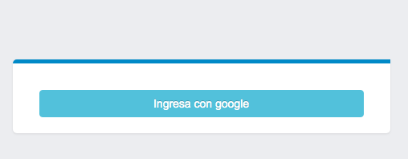
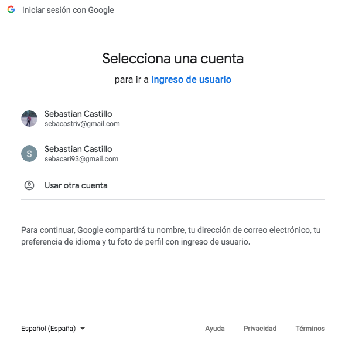
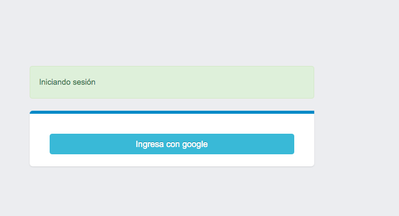
Pasos:
- Se envía un post a la ruta '/login'
- Se comprueba el usuario de Google
- Se comprueba el email en Mysql (si no existe se inserta)
- Se comprueba la llave (si no existe se crea)
- Se guarda el perfil de Google (en archivo json)
- Se genera el token (doble llave pública, eventualmente planeo pasarlo a llaves privadas y públicas .pem generados desde un script de Python)

- Perfil de usuario:
Panel de administración donde se pueden agregar contactos y cargar servicios (solo Mapa disponible)
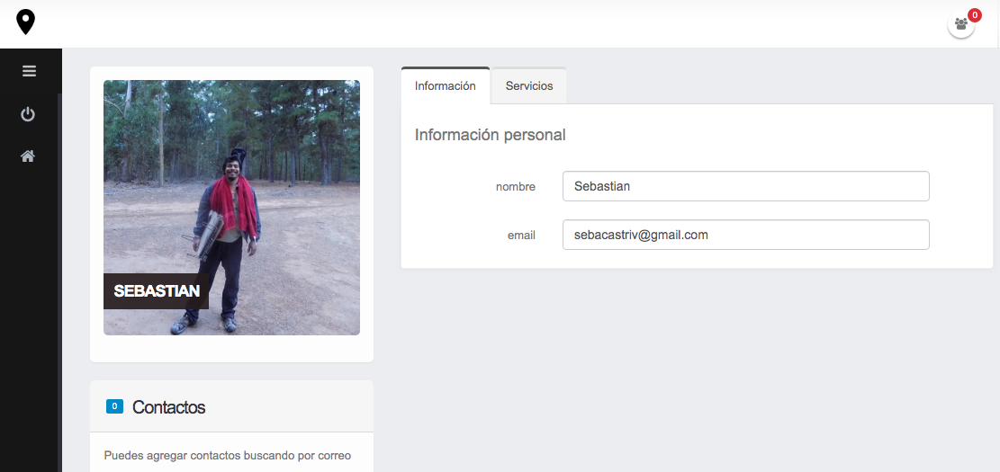
Pasos
- Se solicitan los datos del perfil (archivo json)
- Se solicita la lista de contactos (Mongodb)

- Contactos:
Para compartir la ubicación hay que agregar contactos. Esto se hace mediante un sistema de solicitudes y gestión de contactos que se almacenan en MongoDb.
Un usuario envía la solicitud, y el receptor decide si acepta o rechaza la solicitud
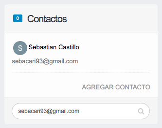
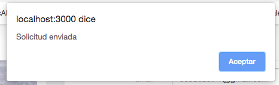
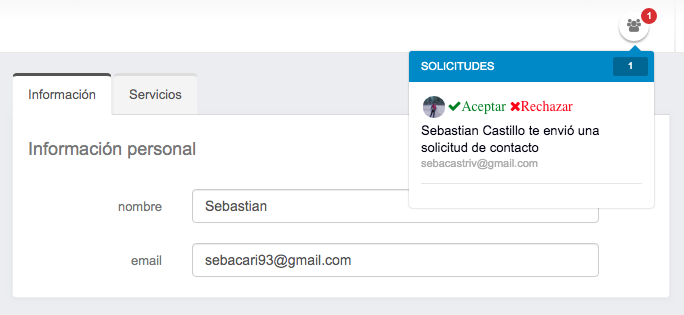
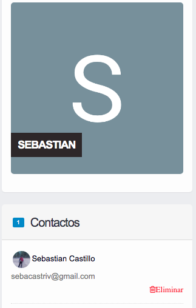
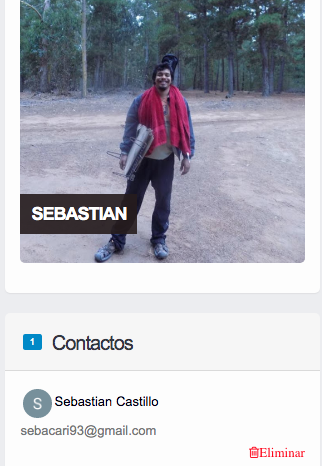

- Mapa:
Para poder acceder al componente Mapa, primero hay que cargar el servicio en la pestaña servicios
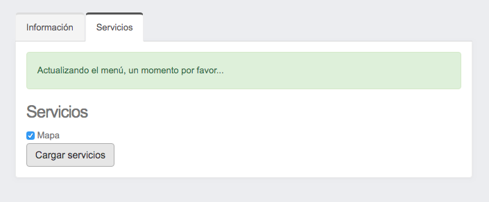
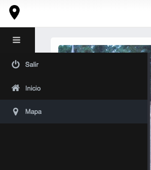

Una vez cargado el servicio, se podrá visualizar la ultima ubicación compartida del usuario

OJO!, la ubicación solo se comparte cuando se accede al componente Mapa.
Ademas el mapa solo se carga cuando se acepta compartir la ubicación.

Al hacer click en la imagen del usuario en el mapa, aparece un pop-up con el email, la fecha, hora, latitud y longitud de la ultima inserción del usuario.
Los datos se almacenan en una colección de Mongodb

----------------------
mapa-social (react js)
----------------------
Modulos internos:
- funciones
Componentes:
- Acceso
- Login
- Principal
- Cab
- Menu
- Cuerpo
- PerfilUsuarios
- Mapa
- NotiContactos
- Contactos

Modulos externos:
- react
- react-google-login
- google-map-react
- reactjs-popup

---------------------- 
api-mapa (express js)
----------------------
Rutas de
login:
- post: '/'

users:
- get: '/'
- get: '/perfil'
- get: '/menu'
- post: '/menu'

contactos:
- get: '/'
- put: '/'
- post: '/eliminar'
- get: '/perfil-sugerido'
- put: '/solicitud'
- get: '/solicitudes'
- post: '/solicitud/rechazar'

gms:
- post: '/'

Modulos externos:
- http
- http-errors
- express
- cookie-parser
- cors
- jsonwebtoken
- fs
- mongodb
- mysql
- googleapis

